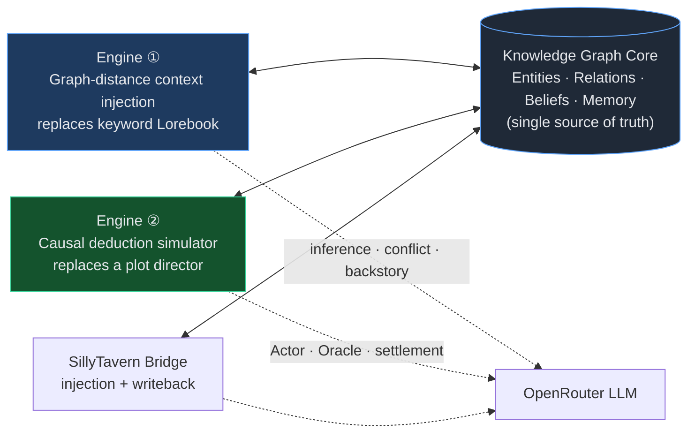

# WorldBuilder 🌐

[简体中文](README.md) · **English**

> Building a story bible is like running an intelligence investigation — you are the chief analyst of your own world.
>
> *A knowledge-graph worldbuilding platform that treats your story bible like an OSINT investigation.*


WorldBuilder is a **knowledge-graph–centric** worldbuilding and investigation platform. Borrowing the interaction paradigm of OSINT intelligence tools ([Maltego](https://www.maltego.com/)), it organizes characters, places, events, and factions into a visual relationship graph, solving the two biggest pain points of complex settings:

- **Tangled character relationships** — with dozens of characters and hundreds of relations, even the author eventually loses track of who is what to whom.
- **AI generating OOC (out-of-character) content** — traditional Lorebooks inject everything by keyword matching, wasting tokens and "bleeding" concepts together, so the AI gradually drifts characters off-model.

WorldBuilder replaces keyword matching with **graph-distance–driven precise context injection**: it feeds the AI only the settings within N hops of the characters currently on stage (hop count is configurable per scenario in settings) — token-efficient, and able to proactively warn about contradictions in the setting.

In addition, it ships with an **agent relationship-evolution simulator** (causal deduction, fog of war, belief layer) and a **SillyTavern plugin** (context injection + dialogue writeback), connecting the graph, simulated memory, and roleplay dialogue.

### One picture

WorldBuilder = **one knowledge-graph core + two engines + one external bridge**. The knowledge graph is the single source of truth; both engines read from it and write back to it, and the SillyTavern bridge connects all of this into roleplay dialogue:



> 📐 For a full walkthrough of the project's design (data model, the two engines, belief layer, memory retrieval, curtain mechanism, ST bridge), see **[`docs/architecture.en.md`](docs/architecture.en.md)**.

---

## Table of contents

- [Core capabilities](#-core-capabilities)
- [Compared with similar projects](#-compared-with-similar-projects)
- [Architecture overview](docs/architecture.en.md)
- [Quick start](#-quick-start)
- [Importing worldbuilding data](#-importing-worldbuilding-data)
- [Simulator: deduction mechanics](#-simulator-deduction-mechanics)
- [Import / Export](#-import--export)
- [SillyTavern plugin](#-sillytavern-plugin)
- [Integration & regression testing](#-integration--regression-testing)
- [Cursor Skills](#-cursor-skills)
- [Tech stack](#-tech-stack)
- [API endpoints](#-api-endpoints-excerpt)
- [Project structure](#-project-structure)
- [License](#-license)

---

## ✨ Core capabilities

### Knowledge graph and canvas

| Capability | Description |
|------|------|
| **Maltego-style Transforms** | Right-click a node → radial expansion of relations; characters/places/events each have dedicated actions (related people, participated events, hostile factions, AI inference, etc.) |
| **Exploration mode** | "Only show this subgraph" from any node; Transforms reveal relations step by step, with undo (⌘Z) and reset-to-seed |
| **Canvas interaction** | Marquee / lasso multi-select, drag undo/redo (⌘Z / ⌘⇧Z), node isolation and hiding |
| **Configurable hop count** | Five query depths (1–5 hops) configured independently: Transform, hostile factions, AI context, ST injection, exploration subgraph |
| **Event graph & timeline** | Causal graph (`caused` / `followed_by` + ELK layout); the timeline orders by `properties.time` and jumps/highlights |

### AI assistance (OpenRouter, configurable model)

- **Infer relations** — analyze relationships that may exist between characters but aren't yet recorded
- **Detect contradictions** — friend/foe contradictions, personality conflicts, timeline conflicts
- **Generate backstory** — produce self-consistent character backstories from the graph
- **Suggestion review** — all AI output first enters a review panel; it lands in the database only after you accept / reject each item

### Graph-distance context injection (vs. traditional Lorebook)

| | Traditional ST Lorebook | WorldBuilder |
|---|---|---|
| Trigger | Keyword matching | N-hop graph query (configurable) |
| Injection volume | O(N) everything | Precise, by graph distance |
| Result | Token waste + concept bleed | Token-efficient + anti-OOC |
| Contradictions | Unaware | Proactive contradiction warnings |

### Agent relationship-evolution simulator

The simulator advances the world in **ticks**, positioned as a **causal-deduction engine**, not a plot director:


| Capability | Description |
|------|------|
| **Single-step / auto-evolution** | Advance one tick manually, or run a background loop that auto-ticks at intervals (real-time push via SSE) |
| **Replay and reset** | Drag the tick timeline to review history; one-click reset to the simulation's initial state |
| **Fog of war** | Entity-level / property-level visibility; canvas "view as …" preview |
| **Belief layer** | Each character maintains a subjective copy of the world; the **Belief / Truth** panel contrasts stale perception against the canonical truth |
| **Multi-dimensional memory retrieval** | An Actor's "recent experiences" are weighted across three dimensions — recency·relevance·importance (homage to Generative Agents `new_retrieve`) — so old-but-relevant events can resurface; relevance uses keyword/participant overlap, zero extra dependencies |
| **World book** | Graph-anchored hard retrieval (`global` always-on + `entity`-mounted), injected by entities present |
| **Heuristic Nudge** | Inject a vague premonition into a character — random / targeted / by social connection — to break a stalemate |
| **Pending events & deduction settlement** | Preset or self-registered `pending` events; once causally ripe, `resolve` lands irreversible consequences; on settlement each participant's goal is marked `achieved`/`defeated`/`ongoing` — a winner's goal becomes "settled" and won't start the same fight again |
| **Event crystallization** | The Oracle crystallizes important turning points into event nodes, shown as chips in the interaction feed; semantic dedup folds near-duplicate repeats |
| **Steady-state curtain** | Decides whether the world has reached equilibrium by "progress" (not "did anything move"); after `stability_window` consecutive no-progress ticks it auto-pauses and shows "🎬 Act curtain", and you can keep advancing to inject new variables |
| **ST writeback** | SillyTavern dialogue is queued first, then reviewed under the **"ST Writeback"** tab and committed manually / every N rounds / auto-LLM |

#### Design principles

- **LLM = character decisions + world adjudication**, not a screenwriter; the prompt emphasizes causal plausibility, not dramatic tension
- **Preset anchors are cold-start only**; `sequence_order` constrains the ordering of guiding events at import time, after which characters' goals drive the autonomous registration of new pendings
- **It doesn't write an ending, but it does fall a curtain** — there is no three-act structure or scripted ending; but when the world reaches a new equilibrium (no substantive progress for several consecutive ticks) it **auto-pauses and shows "Act curtain"**, rather than manufacturing conflict to live forever. "The director doesn't decide what happens, the world state does" — the real world, too, settles into new equilibria
- **Actor information asymmetry** — each encounter is narrated only from the initiator's belief copy; the opponent's belief is mechanically synced afterward

### SillyTavern bridge

- **Character card import** — import TavernAI / SillyTavern character cards (`.json` or embedded PNG) from the Palette, auto-creating character entities; an embedded `character_book` becomes an entity-mounted world book
- **ST plugin v0.6** — graph / visibility / belief context injection, simulated memory block, dialogue writeback queue

---

## 🔍 Compared with similar projects

WorldBuilder straddles two tracks that are usually viewed separately — **generative-agent simulation** (the Generative Agents lineage) and **worldbuilding / roleplay context** (Lorebooks, worldbuilding wikis). Its differentiation isn't being stronger at any single point, but **stitching these two threads onto the same knowledge graph**:

| Project | Positioning | Core mechanism | Autonomous causal deduction | Information asymmetry / fog of war | Roleplay dialogue integration | Chinese-first |
|------|------|----------|:---:|:---:|:---:|:---:|
| **WorldBuilder (this project)** | Knowledge-graph worldbuilding **+** agent deduction | Graph core + graph-distance context injection + Actor/Oracle deduction | ✅ tick-based, no director | ✅ belief copies / visibility fog | ✅ native ST plugin (injection + writeback) | ✅ |
| [Stanford Generative Agents](https://github.com/joonspk-research/generative_agents) | Academic research: agent social-behavior simulation (Smallville) | Memory stream (recency·relevance·importance) + reflection + planning | ✅ wall-clock town sandbox | ❌ omniscient, no subjective-belief contrast | ❌ not a dialogue product, relies on replay data | ❌ |
| [AI Town](https://github.com/a16z-infra/ai-town) | Deployable generative-agent town | GA ideas engineered (Convex + JS), real-time multiplayer | ✅ real-time roaming / dialogue | ❌ | ➖ built-in chat, not an external RP frontend | ❌ |
| [GPTeam](https://github.com/101dotxyz/GPTeam) | Multi-agent collaboration simulation | GA-inspired memory / planning / reaction (Python) | ✅ task-collaboration oriented | ❌ | ❌ | ❌ |
| [SillyTavern](https://github.com/SillyTavern/SillyTavern) + Lorebook | Roleplay dialogue frontend | Keyword-triggered World Info bulk injection | ❌ no simulation | ❌ | ✅ it *is* the RP frontend | ➖ |
| World Anvil / LegendKeeper | Worldbuilding wiki | Articles + manual relation graph | ❌ | ❌ | ❌ | ➖ |

> ✅ has it　➖ partial / non-native　❌ doesn't have it. The comparison is based on each project's **primary positioning**; feature boundaries evolve with versions.

**One-line positioning**: WorldBuilder ≈ *the memory / deduction core of Generative Agents* + *a worldbuilding tool* + *a precise replacement for the Lorebook*, all three combined, and **Chinese-first**.

- Compared with the **Generative Agents lineage** (GA / AI Town / GPTeam): those are sandboxes for "letting agents come alive on their own"; WorldBuilder connects the same cognitive loop (the [three-dimensional memory retrieval](docs/architecture.en.md#6-memory-retrieval-from-pure-recency-to-three-dimensional-weighting-homage-to-generative-agents) is a direct homage to GA `new_retrieve`) onto **the worldbuilding graph you built by hand**, and additionally introduces **belief copies / fog of war** — the same event can be remembered differently by different characters, which is the source of tension in mystery deduction.
- Compared with the **SillyTavern lineage**: Lorebooks inject everything on keyword hits, wasting tokens and easily bleeding concepts; WorldBuilder injects precisely by **N-hop graph distance** and proactively warns about contradictions. The two aren't purely competitors — WorldBuilder **natively provides an ST plugin** that connects the graph, simulated memory, and RP dialogue.
- Compared with **worldbuilding wikis** (World Anvil etc.): they are good at "recording" a static world; WorldBuilder lets that world **deduce forward on its own** and feeds the settings straight into AI dialogue.

---

## 🚀 Quick start

### 1. Backend

```bash
cd backend
python3.13 -m venv venv
source venv/bin/activate
pip install -r requirements.txt

cp .env.example .env
# Edit .env and fill in your OpenRouter API Key

uvicorn app.main:app --host 0.0.0.0 --port 8000 --reload
```

The backend starts on http://localhost:8000 (the SQLite database is created automatically).

> If you see `Address already in use`, an instance is already running: `lsof -ti:8000 | xargs kill`, then start again.

### 2. Frontend

```bash
cd frontend
npm install
npm run dev
```

Visit http://localhost:5173

### 3. Configure AI

In the app's "Settings", fill in your OpenRouter Key and model (per-project configuration supported), or set a global default in `backend/.env`.

### 4. Docker deployment (production)

```bash
cp .env.example .env   # fill in OPENROUTER_API_KEY
docker compose build
docker compose up -d
```

Visit http://localhost:8090 — nginx serves the frontend and reverse-proxies `/api` to the backend; SQLite data persists in `./data/`.

---

## 📦 Importing worldbuilding data

`scripts/` provides a generic importer that bulk-writes the graph from a Python data module:

```bash
# Make sure the backend is running
cd scripts
python3 import_world.py sanguo_data
```

A data module must export three constants: `PROJECT`, `ENTITIES`, `RELATIONS`.

### Built-in samples

| File | Description |
|------|------|
| `scripts/sanguo_data.py` | Romance of the Three Kingdoms (137 entities, 177 relations) |
| `scripts/seed_sanguo.py` | Thin wrapper, equivalent to `import_world.py sanguo_data` |
| `scripts/sim_test_data.py` | Minimal simulator test (3 people + teahouse + theft case) |
| `scripts/seed_sim_test.py` | Thin wrapper importing the minimal test graph |
| `scripts/manor_mystery_data.py` | **Foggy Harbor · Li Manor** — an 8-character closed mystery, with 3 preset pending anchors |
| `scripts/evolution_test_data.py` | Evolution-test graph (validates autonomous event registration and goal-driven evolution) |
| `scripts/seed_evolution_test.py` | Thin wrapper importing the evolution test |

```bash
# Closed mystery (recommended for running the simulator)
python3 import_world.py manor_mystery_data

# Evolution-mechanism test
python3 import_world.py evolution_test_data
```

Specify the API address in a Docker environment:

```bash
WORLDBUILDER_API=http://localhost:8090/api python3 import_world.py manor_mystery_data
```

If a project with the same name exists, it is deleted and rebuilt first. To create a new world: copy `sanguo_data.py`, rewrite it as `myworld_data.py`, and import.

A data module can attach deduction metadata to event nodes:

```python
{
    "name": "The real will surfaces",
    "type": "event",
    "properties": {
        "status": "pending",
        "stakes": "The inheritance order is completely reversed…",
        "due_tick": 10,
        "sequence_order": 2,  # only constrains the settlement order of preset guiding anchors
    },
}
```

---

## 🎲 Simulator: deduction mechanics

### The flow of one tick

1. **Nudge** (optional) — inject a vague premonition into selected characters
2. **Scheduler** — pick encounter pairs by social weight / randomness / conflict matching
3. **Actor** — each encounter generates narrative and intent from the initiator's belief context
4. **Oracle** — whole-tick adjudication: relation mutations, event crystallization, pending registration, `ripe_events` signals
5. **Deduction settlement** — causally-ripe `pending` events call `ai_resolve_event` to land consequences
6. **Belief sync** — participants update each other's subjective copies
7. **Memory write** — episodic memory is appended, and compressed above a threshold
8. **SimTick snapshot** — full interactions / mutations / metrics are persisted

### Pending event lifecycle

| Stage | Description |
|------|------|
| `pending` | At registration, writes `stakes`, `due_tick` (optional), `sequence_order` (preset anchor) |
| Oracle `ripe` | The LLM judges causal maturity; a ripe signal before `due_tick` is invalid |
| `resolve` | After settlement `status=resolved`, writes `outcome`, produces irreversible mutations; and marks each participant's `goal_status` (`achieved`/`defeated` goals become "settled", only `ongoing` ones are reassigned a new goal) |
| Autonomous registration | Character goal-conflict scan / pending-gap reseeding / intent fallback, with no manual pre-seeding; all require **real forward tension** (relation weight reaching a tier + an unsettled goal) to trigger, allowing the pending queue to stay empty when the world quiets down |

### Key configuration (`Simulation.config`)

| Key | Default | Description |
|----|------|------|
| `max_encounters_per_tick` | 4 | Max encounters per tick |
| `scheduler_mix_conflict` | false | Additionally match a hostile/stranger pair |
| `generate_events` | true | Whether the Oracle crystallizes event nodes |
| `event_min_significance` | 0.6 | Significance threshold for a scene to crystallize into an event node (higher = more restrained) |
| `pending_max_age` | 8 | Force-settle a pending on timeout (0 = off) |
| `nudge_strategy` | off | Perturbation strategy: off / random / targeted / weighted |
| `tick_interval_sec` | 6 | Auto-evolution interval (seconds) |
| `max_ticks` | 0 | Auto-pause cap (0 = unlimited) |
| `stability_window` | 4 | Auto-curtain pause after consecutive no-**progress** ticks (`reason=quiescent`, 0 = off) |

### Recommended workflow (Foggy Harbor · Li Manor)

```bash
cd scripts && python3 import_world.py manor_mystery_data
```

1. Open the **Foggy Harbor · Li Manor** project in the frontend
2. Simulator → **＋ New simulation** (hybrid mode)
3. **Single-step ⏭** to observe step by step, or **▶ Auto-evolve** to advance in the background (interaction feed updates live via SSE)
4. In the **Belief / Truth** panel, switch observers to contrast subjective perception with the canonical truth
5. View the event graph / timeline to watch how the causal chain `followed_by` grows

The three preset anchors (`sequence_order` 1→2→3) should settle in order along the causal chain: **the will reading → the real will surfaces → the cause-of-death verdict**. After that the world continues to evolve driven by character goals; when everyone's goals have settled and there's been no substantive progress for several consecutive ticks, the simulator **auto-pauses and shows "🎬 Act curtain" at the top of the interaction feed** — at which point you can manually keep advancing (inject new variables) or reset and rerun.

> For the complete mechanics of the deduction engine (deduction settlement, progress checking, the curtain, goal achievability, anti-exhaustion throttles), see [`docs/simulation-engine.en.md`](docs/simulation-engine.en.md).

---

## 📥 Import / Export

Beyond bulk script import, the app supports JSON-format exchange of world books and entire project graphs:

| Type | Scope | Entry point |
|------|------|------|
| **World book** | Entries (lore), appended to the current project | World book panel `⬆ Import` / `⬇ Export` |
| **Graph** | Entities + relations + world book, as a new project | Per-row `⬇` export in the project switcher, `⬆ Import graph` at the bottom |
| **Character card** | A single character entity + embedded world book | Palette `Import character card` (`.json` / `.png`) |

World book import automatically recognizes SillyTavern Lorebook / World Info / V2 character-card embedded entries. See [`docs/import-export.en.md`](docs/import-export.en.md).

---

## 🔌 SillyTavern plugin

The plugin lives in `st-plugin/` (**v0.6.0**) and is compatible with the **SillyTavern 1.18+** extension API.

### Installation

```bash
cp -r st-plugin "<SillyTavern>/data/<your-user>/extensions/worldbuilder-context"
```

Or install via Git URL in SillyTavern's "Extensions → Install extension".

### Settings

| Setting | Description |
|------|------|
| **Context mode** | `visibility` (default, character-card-view fog) · `truth` (omniscient) · `belief` (belief copy, may be stale) |
| **Project / Simulation** | Choose the WB project and simulation; memory injection and writeback require binding a Simulation |
| **Inject memory** | Inject this character's episodic memory block from the simulator |
| **Queue writeback** | Queue after each dialogue round, to be reviewed in WB **"ST Writeback"** |
| **Inject at** | `before_char` / `after_char` / `before_system` / `before_scenario` / `macro_only` |

> **The character card name must exactly match the graph entity `name`** (e.g. "Lin Yuan"), otherwise the plugin will report it as unbound.

### Usage flow

1. Start the WorldBuilder backend (default `http://localhost:8000`).
2. In the SillyTavern "Extensions" panel, expand **🌐 WorldBuilder**, choose a project, and set the Context mode.
3. Optional: bind a Simulation, enable memory injection or writeback queuing.
4. Chat normally — the plugin injects context at `CHAT_COMPLETION_PROMPT_READY`; writeback is reviewed in the WB simulator.

> ⚠️ If both SillyTavern and the WB backend occupy 8000, change ST's `config.yaml` to `port: 8100` (or another port).

### How it works

```
CHAT_COMPLETION_PROMPT_READY
  → extract character-card name + @mentions
  → GET /entities/context or /beliefs/context (?observer=card-name)
  → optional GET /simulations/{id}/memory-block
  → inject a system message

GENERATION_END (optional)
  → POST /simulations/{id}/st-writeback/queue
  → WB "ST Writeback" panel: preview / apply / discard
```

Writeback trigger modes (configured in the WB simulator, stored in `Simulation.config`):

| Mode | Behavior |
|------|------|
| `manual` | Queue only; the user checks items and applies |
| `every_n_rounds` | Auto-apply once N pendings accumulate |
| `auto_llm` | Each queued item is immediately Oracle-written-back and tick+1 |

See [`st-plugin/TESTING.md`](st-plugin/TESTING.md) and [`st-plugin/CHANGELOG.md`](st-plugin/CHANGELOG.md).

---

## 🧪 Integration & regression testing

### ST + WB integration

```bash
# Terminal 1: WB backend
cd backend && uvicorn app.main:app --reload

# Terminal 2
cd scripts
python3 seed_sim_test.py
python3 st_plugin_integration_test.py
```

Generate character-card PNGs for SillyTavern with names matching the graph (Lin Yuan, Xiao Xia, A Ming):

```bash
node scripts/create_st_characters.mjs [SillyTavern-root]
# defaults to writing into <ST>/data/default-user/characters/
```

### Deduction-engine regression (no LLM required)

```bash
cd scripts
python3 deduction_regression_test.py    # pending maturity / sequence_order / autonomous-registration logic
python3 sim_engine_regression_test.py # simulator core paths
```

---

## 🎯 Cursor Skills

`skills/` holds Cursor Agent Skills **for users to attach manually** (unrelated to the `.cursor/` IDE configuration).

In a Cursor conversation, `@` → **Attach Skill** → choose `skills/worldbuilder-import/SKILL.md`, and the AI will research source material to spec, write the data file, and import the graph. See [skills/README.md](skills/README.md).

---

## 🧱 Tech stack

| Layer | Technology |
|----|------|
| Frontend | React 19 + TypeScript + Vite |
| Graph visualization | [@xyflow/react](https://reactflow.dev/) + ELKjs auto-layout |
| State management | Zustand |
| Markdown | react-markdown + remark-gfm |
| Backend | Python 3.13 + FastAPI + Uvicorn |
| Data/graph storage | SQLite + SQLAlchemy (async) + in-memory adjacency-list graph engine |
| AI | OpenRouter (OpenAI-compatible, configurable model) |
| Simulator | Actor / Oracle two-stage LLM + causal deduction + SSE streaming |
| ST plugin | SillyTavern 1.18 Extension API |

---

## 📡 API endpoints (excerpt)

| Method | Path | Description |
|--------|------|------|
| `POST` | `/api/projects` | Create a project |
| `POST` | `/api/projects/import` | Create a project from a bundle |
| `GET`  | `/api/projects/{id}/entities` | List entities |
| `POST` | `/api/projects/{id}/entities/import-card` | Import an ST character card as a character entity |
| `GET`  | `/api/projects/{id}/entities/context` | ST graph context (visibility-filtered) |
| `POST` | `/api/projects/{id}/beliefs/seed` | Idempotently seed belief rows |
| `GET`  | `/api/projects/{id}/beliefs/context` | ST belief context |
| `POST` | `/api/projects/{id}/simulations` | Create a simulation |
| `POST` | `/api/projects/{id}/simulations/{sid}/step` | Advance one tick (returns 409 while running) |
| `POST` | `/api/projects/{id}/simulations/{sid}/play` | Start background auto-evolution |
| `POST` | `/api/projects/{id}/simulations/{sid}/pause` | Pause background evolution |
| `POST` | `/api/projects/{id}/simulations/{sid}/reset` | Reset to the initial snapshot |
| `GET`  | `/api/projects/{id}/simulations/{sid}/stream` | SSE real-time tick stream |
| `GET`  | `/api/projects/{id}/simulations/{sid}/memory-block` | Formatted memory block (ST injection) |
| `POST` | `/api/projects/{id}/simulations/{sid}/st-writeback/queue` | Queue ST dialogue |
| `GET`  | `/api/projects/{id}/entities/{eid}/neighbors` | N-hop neighbor query |
| `POST` | `/api/projects/{id}/transforms/execute` | Execute a Transform |

Full API in the FastAPI auto-docs: http://localhost:8000/docs

---

## 📂 Project structure

```
world_builder/
├── backend/
│   ├── app/
│   │   ├── main.py
│   │   ├── models/           # Entity, Relation, Simulation, Belief, StWritebackQueue…
│   │   ├── routers/          # projects, entities, relations, transforms,
│   │   │                     #   simulations, world_entries, beliefs
│   │   ├── services/         # ai_service, simulation, belief, memory,
│   │   │                     #   sim_runner, st_writeback
│   │   └── graph/            # in-memory graph engine, visibility, worldbook
│   └── requirements.txt
├── frontend/
│   └── src/components/
│       ├── Simulator/        # InteractionFeed, BeliefPanel, WritebackPanel, TickTimeline
│       ├── Canvas/, Inspector/, WorldBook/, EventGraph/, Timeline/, …
│       └── …
├── st-plugin/                # SillyTavern plugin v0.6
├── scripts/                  # data import, sample graphs, integration & regression tests
├── docs/                     # import-export.md, simulation-engine.md
├── skills/
└── docker-compose.yml
```

---

## 📄 License

This project is open-sourced under the [GNU Affero General Public License v3.0](LICENSE).

You may freely use, modify, and distribute this project; if you provide an interactive service of this software over a network, you must offer users the corresponding source code. Any derivative work based on this project must, when distributed, also be open-sourced under AGPL-3.0 with source code provided.
