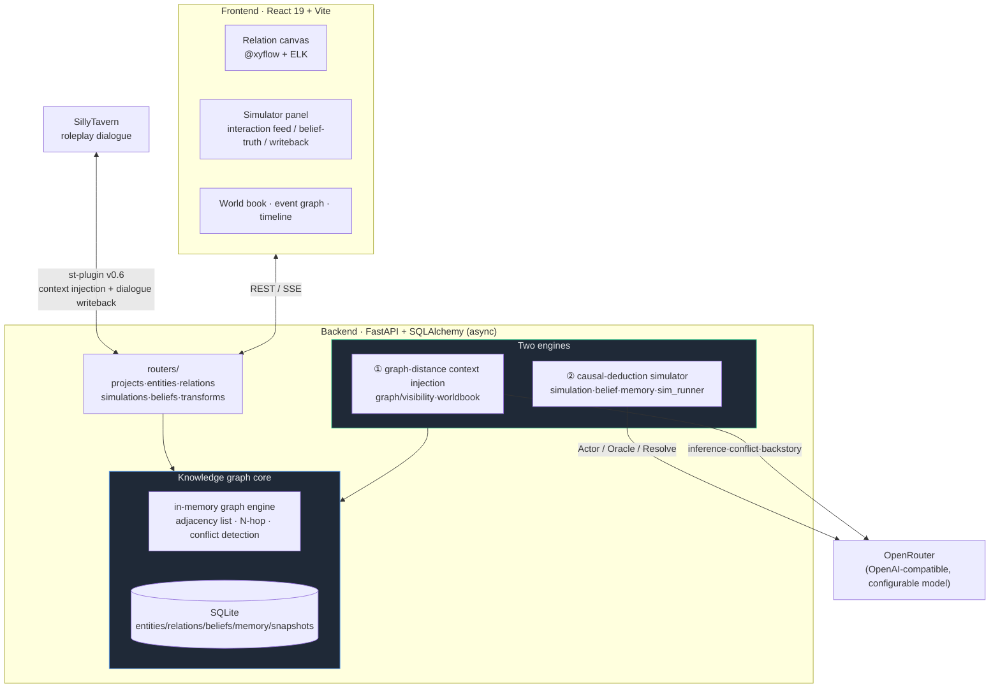
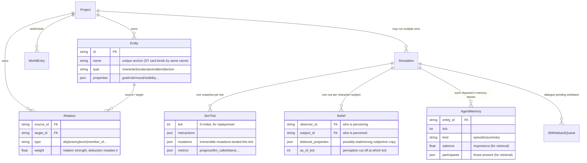
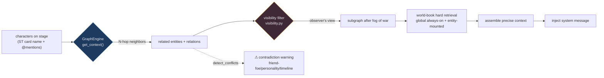
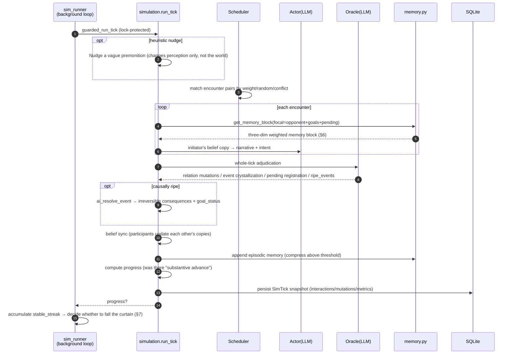
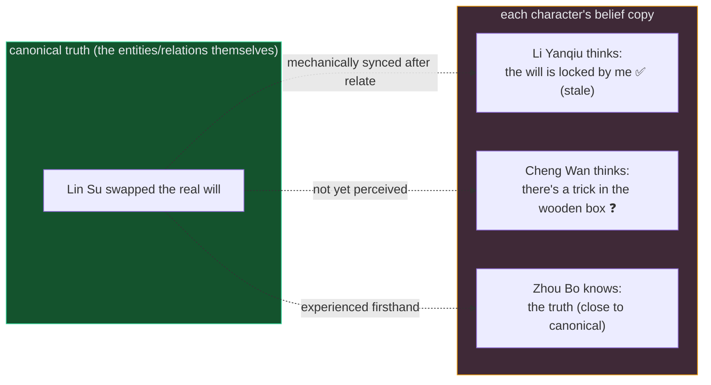
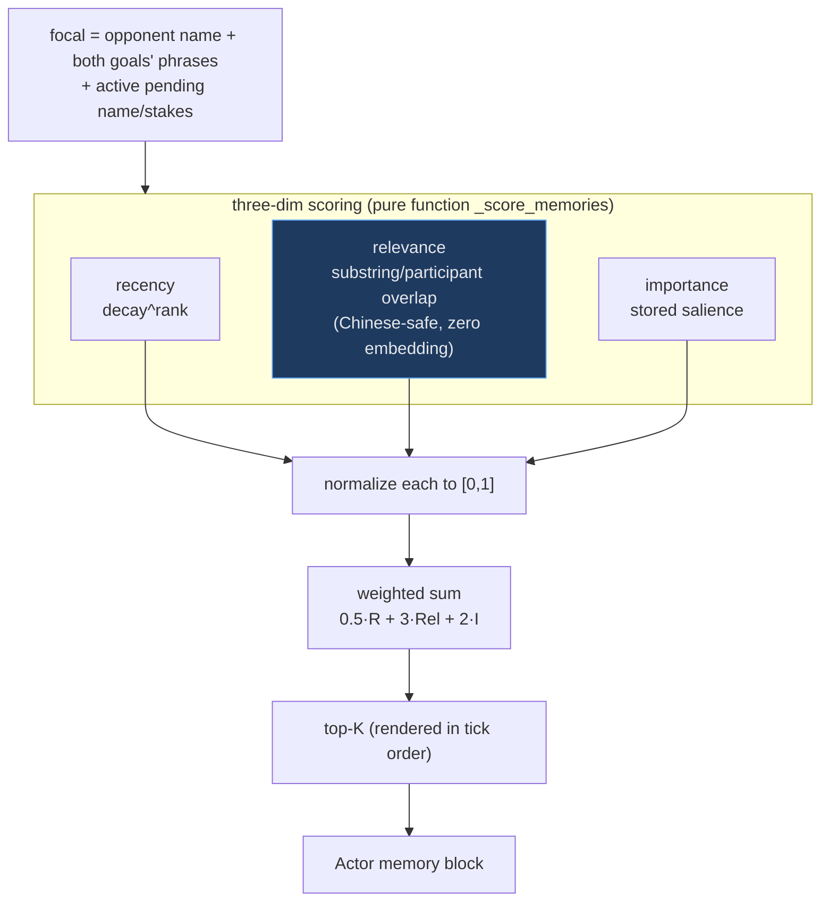
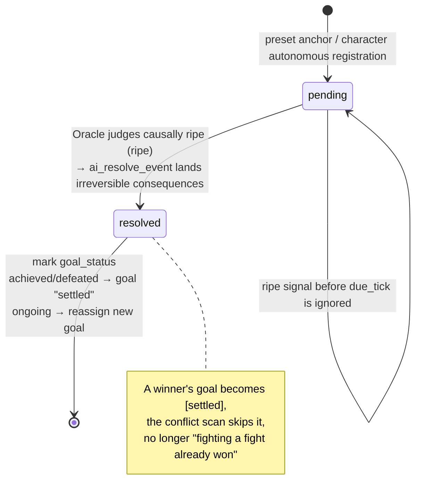
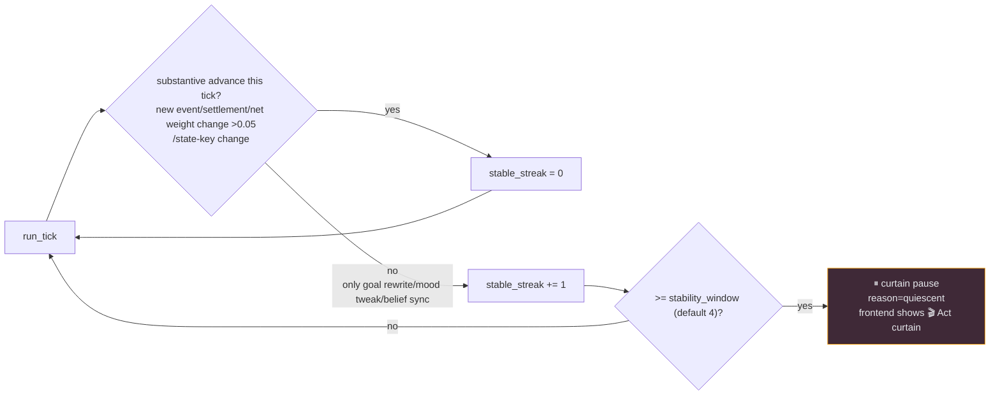
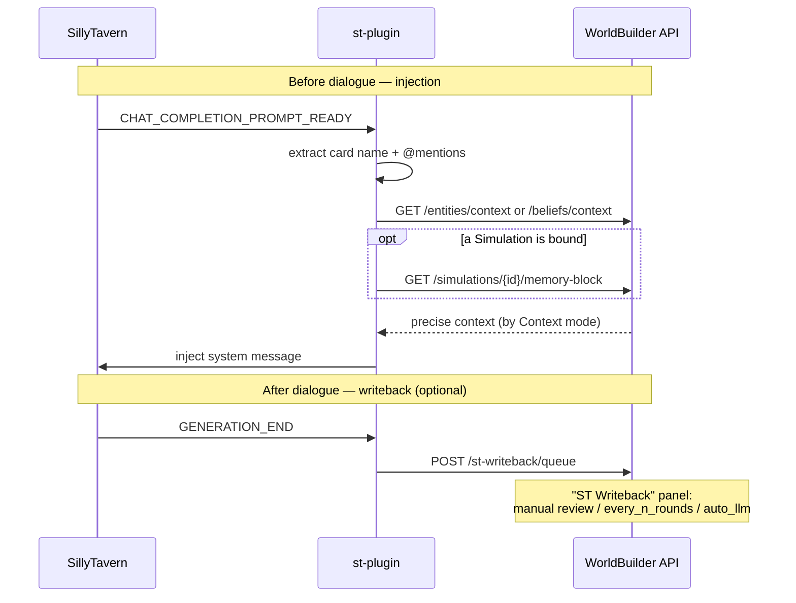

# WorldBuilder architecture overview

[简体中文](architecture.md) · **English**

> In one line: WorldBuilder treats "writing a world bible" as an **intelligence investigation**, then uses a **causal-deduction engine** to let that world move forward on its own.
>
> This document speaks in diagrams to help you build a mental model of the whole project in ten minutes. For per-module implementation details, see [`simulation-engine.en.md`](simulation-engine.en.md) (the deduction engine) and [`import-export.en.md`](import-export.en.md) (import/export).

---

## 1. The whole picture in one diagram

WorldBuilder is not a single application, but **one knowledge-graph core + two engines + one external bridge**. The knowledge graph is the single source of truth; both engines read from it and write back to it, and the SillyTavern bridge connects all of this into roleplay dialogue.

**Why "two engines" and not one?** They solve two different problems of the same world:

| | ① Graph-distance context injection | ② Causal-deduction simulator |
|---|---|---|
| **Question answered** | "Which settings should I feed the AI right now?" | "If I let this world run by itself, what happens?" |
| **View of time** | Static snapshot (the graph as it is now) | Dynamic advance (tick by tick) |
| **What it replaces** | The keyword bulk injection of traditional Lorebooks | A plot director / three-act script |
| **Core mechanism** | N-hop graph query + fog of war | Actor/Oracle two-stage LLM + pending settlement |
| **Entry code** | `graph/engine.py` · `graph/visibility.py` | `services/simulation.py` · `services/sim_runner.py` |

---

## 2. Data model: everything hangs on the graph

The whole system has only one set of core tables. **Entities + relations** form the graph itself; the **simulation-related tables** (Simulation/SimTick/Belief/AgentMemory) all belong to a particular simulation — they are the graph's "copy and replay" along the time dimension.

Three designs worth remembering:

- **`Entity.name` is a hard anchor.** ST character cards bind to entities by matching name; import/writeback both depend on its uniqueness.
- **`Relation.weight` is the fuel of deduction.** Relation strength isn't decorative — the simulator may mutate it every tick, and it in turn decides who meets whom and whether a conflict arises.
- **`Belief` and truth are two separate datasets.** This is the physical basis of "fog of war" and "information asymmetry" — see §5.

---

## 3. Engine ①: graph-distance context injection (replaces the keyword Lorebook)

Traditional Lorebooks rely on keyword matching, injecting everything on a hit — wasting tokens and easily "bleeding concepts" so the AI drifts off-model. WorldBuilder instead **runs an N-hop graph query from the characters currently on stage**, feeding the AI only the close-by settings, and can proactively warn about contradictions before injection.

Hop count is configurable per scenario: Transform expansion, hostile factions, AI context, ST injection, and the exploration subgraph each have an independent depth. This lowers the "injection volume" from `O(all entries)` to "a precise subset bounded by graph distance".

---

## 4. Engine ②: the causal-deduction simulator — the lifecycle of one tick

The simulator's core creed is written into every prompt: **"The director doesn't decide what happens, the world state does."** The LLM plays only two roles — **Actor** (a character acting on their own subjective beliefs) and **Oracle** (the world adjudicating the entire tick) — not a screenwriter. Every outcome is **causally deduced** from relation weights, character goals, pending events, and belief copies.

Key point: **information asymmetry**. Each encounter generates narrative only from the **initiator's belief copy**; the opponent's perception is mechanically synced only afterward — so two characters can have different memories of the same event, which is exactly the source of tension in mystery deduction.

---

## 5. Belief layer: fog of war and information asymmetry

The `Belief` table gives each character a **possibly-stale, possibly-wrong** copy of the world. There is one canonical truth, and N characters means N subjective perceptions.

- The **frontend "Belief / Truth" panel** can switch observers to contrast their stale perception against the canonical truth.
- The **ST plugin has three Context modes**: `visibility` (character-card-view fog) / `truth` (omniscient) / `belief` (inject the subjective copy, may be stale).
- Beliefs are updated by `belief.sync_beliefs` after an encounter, and `reconcile_belief` re-derives goals after settlement.

---

## 6. Memory retrieval: from pure recency to three-dimensional weighting (homage to Generative Agents)

In each encounter, the Actor receives their "recent experiences". The early implementation took the most recent K by time alone — old-but-highly-relevant key memories (like an old grudge with the current opponent) would be crowded out by the latest small talk. Now, when given a focal, `get_memory_block` switches to **recency · relevance · importance** three-dimensional weighted scoring (mirroring GA `new_retrieve`, default weights `gw=[0.5, 3, 2]`) and takes the top-K.

> **Boundary (holding the engine's philosophy)**: retrieval **only reorders which events the Actor recalls — it never rewrites world state or touches goals**. Setting `memory_weighted_retrieval=False` reverts to the pure time window in one switch. Validated on real data: when a character uses an old opponent as the focal, weighted retrieval recovers a high-`salience` settlement memory that the pure time window had discarded. Details in [`simulation-engine.en.md` §3.5](simulation-engine.en.md).

---

## 7. It doesn't write an ending, but it falls a curtain: pending events + progress

The simulator neither manufactures conflict to live forever by script, nor stalls into idle spinning. Two mechanisms cooperate to achieve "stopping naturally when the world reaches a new equilibrium".

**Pending events** are the engine's causal skeleton — a state machine:

**Progress-based curtain**: the background loop judges "was there progress", not "did anything move" (the anti-exhaustion device guarantees a change every tick; judging by "did anything move" would never stop).

---

## 8. SillyTavern bridge: connecting the graph into dialogue

`st-plugin/` (v0.6) hooks SillyTavern at two moments: before dialogue it injects precise context, and after dialogue it queues the plot for writeback into the simulator.

---

## 9. Module quick reference

| Concern | Look here |
|--------|--------|
| Routes / API | `backend/app/routers/` · FastAPI docs `http://localhost:8000/docs` |
| Graph query / N-hop / conflict detection | `backend/app/graph/engine.py` |
| Fog of war / visibility filter | `backend/app/graph/visibility.py` |
| World-book hard retrieval | `backend/app/graph/worldbook.py` |
| **Deduction main flow** `run_tick` | `backend/app/services/simulation.py` |
| Background auto-evolution loop / curtain pause | `backend/app/services/sim_runner.py` |
| Belief copies / information asymmetry / goals | `backend/app/services/belief.py` |
| Memory stream / three-dim weighted retrieval / compression | `backend/app/services/memory.py` |
| Actor / Oracle / settlement LLM | `backend/app/services/ai_service.py` |
| ST dialogue writeback | `backend/app/services/st_writeback.py` |
| Data model (all tables) | `backend/app/models/models.py` |
| No-LLM regression tests | `scripts/deduction_regression_test.py` · `scripts/sim_engine_regression_test.py` |
| Sample world (recommended closed mystery) | `scripts/manor_mystery_data.py` |

---

> To dive into the deduction engine (deduction settlement, progress checking, anti-exhaustion throttles, event-crystallization convergence, the full configuration table): **[`docs/simulation-engine.en.md`](simulation-engine.en.md)**.
