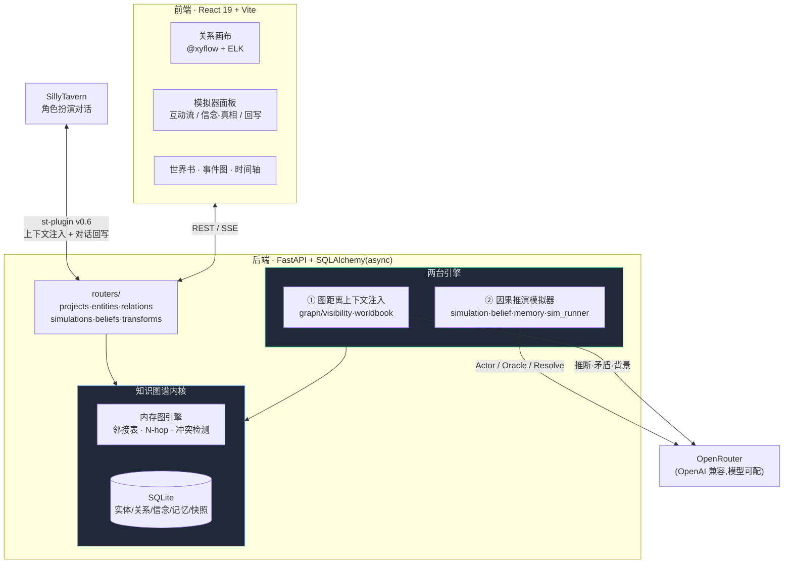
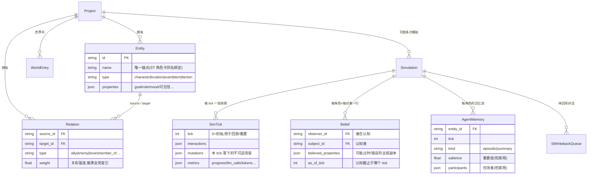
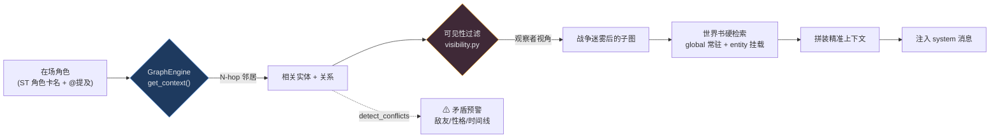
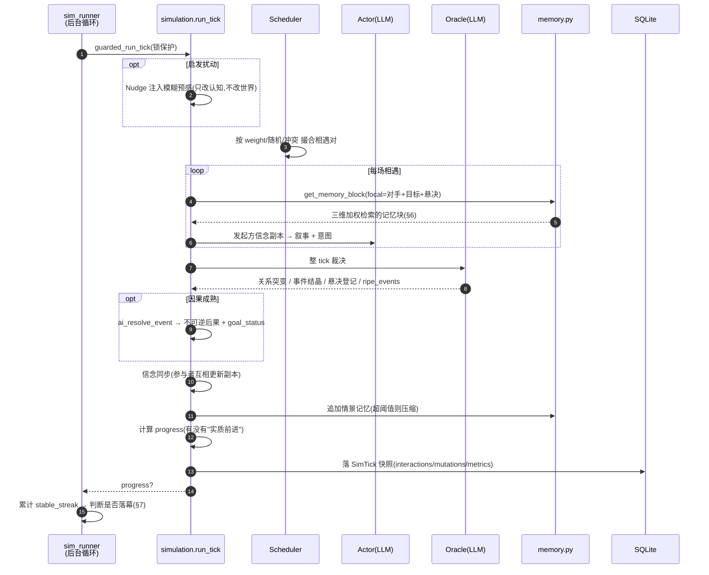
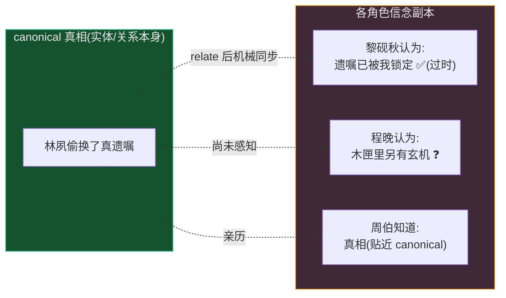
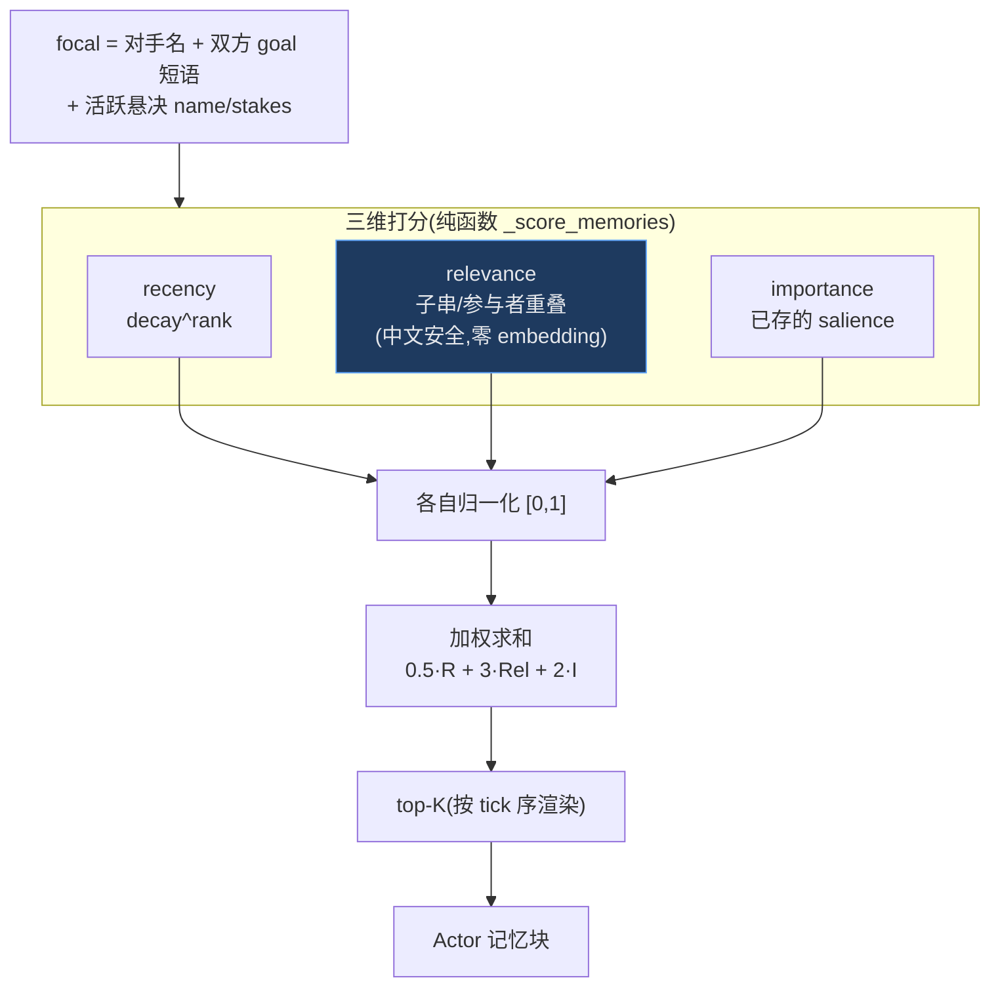
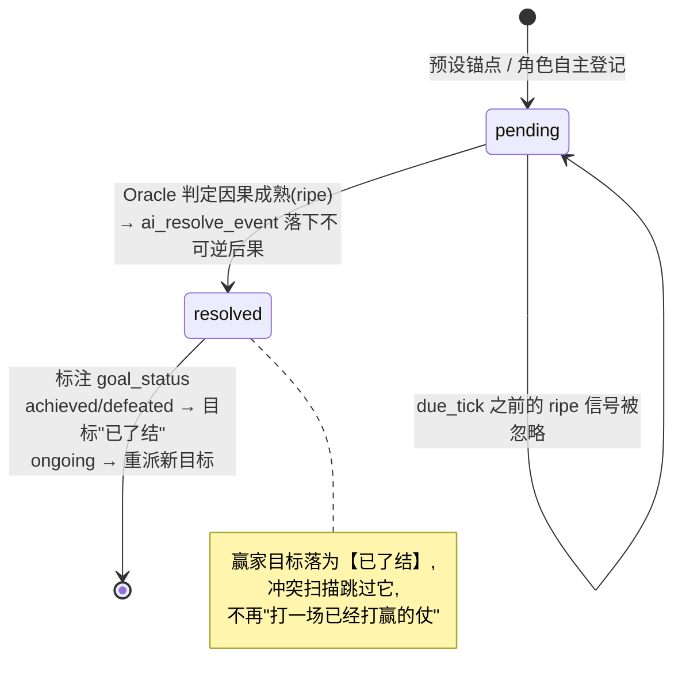
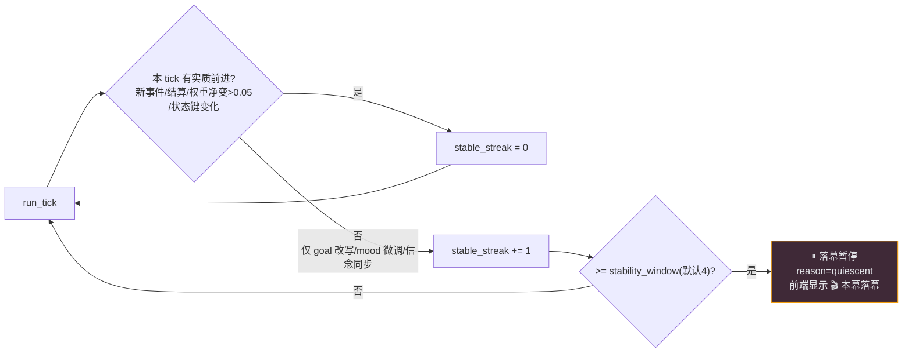
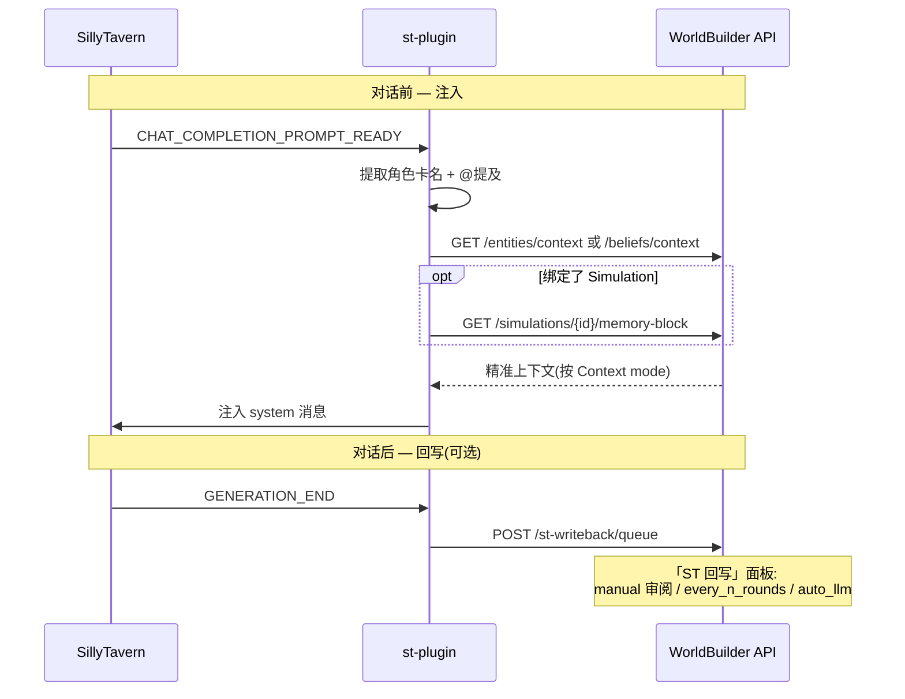

# WorldBuilder 架构总览

> 一句话:WorldBuilder 把「写世界观」当成一次**情报调查**,再用一台**因果推演引擎**让这个世界自己往前走。
>
> 本文用图说话,帮你在十分钟内建立对整个项目的心智模型。逐模块的实现细节见 [`simulation-engine.md`](simulation-engine.md)(推演引擎)与 [`import-export.md`](import-export.md)(导入导出)。

---

## 1. 一张图看懂全局

WorldBuilder 不是单一应用,而是**一个知识图谱内核 + 两台引擎 + 一座对外桥梁**。知识图谱是唯一事实源(single source of truth),两台引擎从它取数、向它回写,SillyTavern 桥把这一切接到角色扮演对话里。

**为什么是「两台引擎」而非一台?** 它们解决的是同一个世界的两个不同问题:

| | ① 图距离上下文注入 | ② 因果推演模拟器 |
|---|---|---|
| **回答的问题** | 「此刻该把哪些设定喂给 AI?」 | 「如果让这个世界自己运转,会发生什么?」 |
| **时间观** | 静态快照(当下的图) | 动态推进(一个个 tick) |
| **取代了什么** | 传统 Lorebook 的关键词全量注入 | 剧情导演 / 三幕剧本 |
| **核心机制** | N-hop 图查询 + 战争迷雾 | Actor/Oracle 双阶段 LLM + 悬决结算 |
| **入口代码** | `graph/engine.py` · `graph/visibility.py` | `services/simulation.py` · `services/sim_runner.py` |

---

## 2. 数据模型:一切都挂在图上

整个系统只有一组核心表。**实体 + 关系**构成图本身;**模拟相关表**(Simulation/SimTick/Belief/AgentMemory)都从属于某次模拟,是图在时间维度上的「副本与回放」。

三个值得记住的设计:

- **`Entity.name` 是硬锚点。** ST 角色卡靠同名绑定到实体,导入/回写都依赖它唯一。
- **`Relation.weight` 是推演的燃料。** 关系强度不是装饰,模拟器每 tick 都可能让它突变,它又反过来决定谁与谁相遇、是否构成冲突。
- **`Belief` 与真相是两份数据。** 这是「战争迷雾」和「信息不对称」的物理基础——见 §5。

---

## 3. 引擎①:图距离上下文注入(取代关键词 Lorebook)

传统 Lorebook 靠关键词匹配,命中即全量注入——token 浪费且容易「串词」让 AI 崩人设。WorldBuilder 改为**从当前在场角色出发做 N-hop 图查询**,只把图距离近的设定喂给 AI,并能在注入前主动预警矛盾。

跳数(hop)可按场景分别配置:Transform 展开、敌对阵营、AI 上下文、ST 注入、探索子图各有独立深度。这把「注入量」从 `O(全部词条)` 降到「图距离可控的精准子集」。

---

## 4. 引擎②:因果推演模拟器 —— 一次 tick 的生命周期

模拟器的核心信条写在每个 prompt 里:**「导演不决定发生什么,世界状态决定。」** LLM 只扮演两个角色——**Actor**(角色基于自己的主观信念行动)与 **Oracle**(世界对整个 tick 做裁决)——而不是编剧。所有结果都从关系权重、角色目标、悬决事件、信念副本里**因果推导**出来。

关键点:**信息不对称**。每场相遇只从**发起方的信念副本**生成叙事,对手的认知事后才被机械同步——所以两个角色可能对同一件事有不同记忆,这正是悬疑推演的张力来源。

---

## 5. 信念层:战争迷雾与信息不对称

`Belief` 表让每个角色都持有一份**可能过时、可能错误**的世界副本。canonical 真相是一份,N 个角色就有 N 份主观认知。

- **前端「信念 / 真相」面板**可切换观察者,对照其过时认知与 canonical 真相。
- **ST 插件三种 Context mode**:`visibility`(角色卡视角迷雾)/ `truth`(全知)/ `belief`(注入主观副本,可过时)。
- 信念由 `belief.sync_beliefs` 在相遇后更新、`reconcile_belief` 在结算后重新推导目标。

---

## 6. 记忆检索:从纯时间到三维加权(致敬 Generative Agents)

每场相遇,Actor 会拿到自己的「近期经历」。早期实现是纯按时间取最近 K 条——久远但高度相关的关键记忆(如与当前对手的旧恩怨)会被最新的闲聊挤掉。现在 `get_memory_block` 在收到 focal 时改走 **recency · relevance · importance** 三维加权打分(镜像 GA `new_retrieve`,默认权重 `gw=[0.5, 3, 2]`),取 top-K。

> **边界(守住引擎哲学)**:检索**只重排 Actor 记得哪些事,绝不改写世界状态、不碰目标**。`memory_weighted_retrieval=False` 可一键回退纯时间窗口。真实数据验证:某角色以旧对手为 focal 时,加权检索能找回纯时间窗口丢弃的高 `salience` 结算记忆。细节见 [`simulation-engine.md` §3.5](simulation-engine.md)。

---

## 7. 不写结局,但会落幕:悬决事件 + 进展度

模拟器既不靠剧本制造冲突无限续命,也不会卡死空转。两套机制配合实现「世界达到新均衡时自然停下」。

**悬决事件**是引擎的因果骨架——一个状态机:

**进展度落幕**:后台循环判「有没有进展」而非「有没有动」(防枯竭装置保证每 tick 都有变更,若按"有没有动"判会永不停)。

---

## 8. SillyTavern 桥:把图谱接进对话

`st-plugin/`(v0.6)在两个时机挂钩 SillyTavern:对话前注入精准上下文,对话后把剧情入队回写到模拟器。

---

## 9. 模块速查表

| 关注点 | 看这里 |
|--------|--------|
| 路由 / API | `backend/app/routers/` · FastAPI 文档 `http://localhost:8000/docs` |
| 图查询 / N-hop / 冲突检测 | `backend/app/graph/engine.py` |
| 战争迷雾 / 可见性过滤 | `backend/app/graph/visibility.py` |
| 世界书硬检索 | `backend/app/graph/worldbook.py` |
| **推演主流程** `run_tick` | `backend/app/services/simulation.py` |
| 后台自动演化循环 / 落幕暂停 | `backend/app/services/sim_runner.py` |
| 信念副本 / 信息不对称 / 目标 | `backend/app/services/belief.py` |
| 记忆流 / 三维加权检索 / 压缩 | `backend/app/services/memory.py` |
| Actor / Oracle / 结算 LLM | `backend/app/services/ai_service.py` |
| ST 对话回写 | `backend/app/services/st_writeback.py` |
| 数据模型(全部表) | `backend/app/models/models.py` |
| 无 LLM 回归测试 | `scripts/deduction_regression_test.py` · `scripts/sim_engine_regression_test.py` |
| 示例世界(推荐悬疑封闭局) | `scripts/manor_mystery_data.py` |

---

> 想深入推演引擎(推演结算、进展度判定、防枯竭节流阀、事件结晶收敛、配置项全表):**[`docs/simulation-engine.md`](simulation-engine.md)**。
