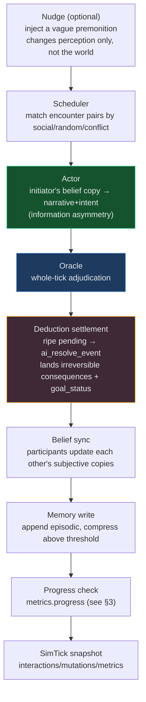
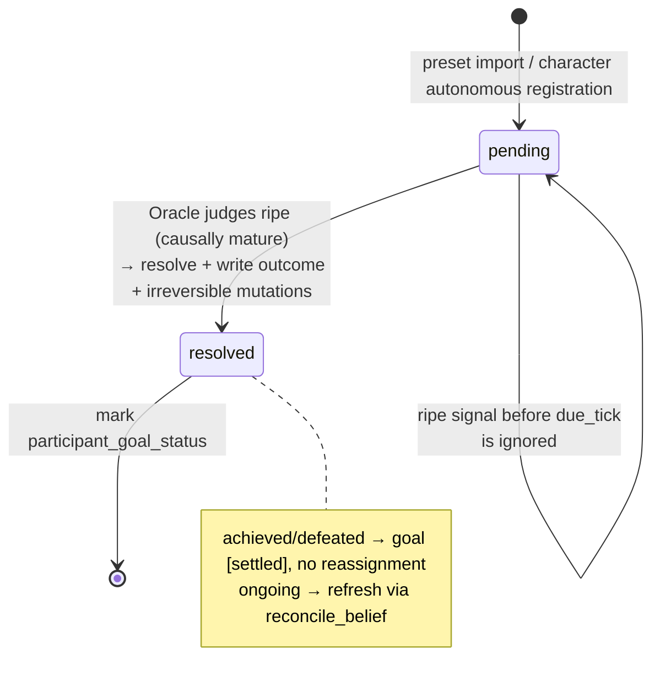

# Simulator deduction engine

[简体中文](simulation-engine.md) · **English**

> "The director doesn't decide what happens, the world state does."

WorldBuilder's simulator is not a plot generator but a **causal-deduction engine**: every tick's outcome is causally deduced from the internal world state (relation weights, character goals, pending events, belief copies), rather than injected as dramatic conflict by a "director". This document explains how the engine advances, how it settles, and — just as important — **how it knows when to stop**.

Relevant code:

- `backend/app/services/simulation.py` — the `run_tick` main flow, deduction settlement, progress checking, anti-exhaustion throttling
- `backend/app/services/sim_runner.py` — the background auto-evolution loop and curtain pause
- `backend/app/services/ai_service.py` — Actor / Oracle / `ai_resolve_event` LLM calls
- `scripts/deduction_regression_test.py` — deterministic regression cases that need no LLM

---

> 📐 Want to build a global mental model first (the two engines, data model, belief layer, ST bridge)? See [`architecture.en.md`](architecture.en.md). This document focuses on the internal mechanics of the deduction engine.

## 1. The lifecycle of one tick



| Stage | Responsibility |
|------|------|
| **Nudge** | Optionally inject a vague premonition into selected characters to break a stalemate (does not change world state directly, only the character's perception) |
| **Scheduler** | Pick this tick's encounter pairs by social weight / randomness / conflict matching |
| **Actor** | Each encounter generates narrative and intent from the **initiator's belief copy** (information asymmetry: the opponent's view is mechanically synced afterward) |
| **Oracle** | Whole-tick adjudication: relation-weight mutation, event crystallization, pending registration, emitting `ripe_events` signals |
| **Deduction settlement** | Causally-ripe `pending` events call `ai_resolve_event` to land irreversible consequences |
| **Belief sync** | Participants update each other's subjective world copies |
| **Memory write** | Episodic memory appended, compressed above a threshold |
| **Progress check** | Compute `metrics["progress"]` (see §3) for the background loop to judge whether the world has entered a steady state |

---

## 2. Pending events and goal achievability

A pending event is the engine's causal skeleton. An event node carries deduction metadata in its `properties`:

```python
{
  "status": "pending",            # pending | resolved
  "stakes": "The inheritance order is completely reversed…",   # what's at stake
  "due_tick": 10,                  # optional; ripe signals before this are invalid
  "sequence_order": 2,             # only constrains the settlement order of preset anchors at import time
  "outcome": "...",               # written after settlement
  "participant_names": [...],
}
```

### Lifecycle



| Stage | Description |
|------|------|
| `pending` | Preset import or character autonomous registration |
| Oracle `ripe` | The LLM judges causal maturity; a ripe signal before `due_tick` is ignored |
| `resolve` | `status=resolved` + write `outcome` + produce irreversible mutations |

### Goal achievability (removing the "goal perpetual-motion machine")

A root cause in early versions: after settlement, all participants were unconditionally given `reconcile_belief` to reassign a new goal, so a winner would **keep fighting a fight already won** — the goal-conflict scan could always find a new conflict → infinitely seeding new pendings.

The fix: `ai_resolve_event` now additionally marks each participant's **`participant_goal_status`**:

| status | Handling |
|--------|------|
| `achieved` / `defeated` | The goal becomes "settled" — `goal` is prefixed with `[Settled]`, a `goal_status` property is written, and **no** new goal is reassigned |
| `ongoing` | Keeps the existing `reconcile_belief` refresh path |

`_goal_is_settled()` then makes the conflict scan skip settled goals, so the winner stands down.

---

## 3. The progress stop signal (the core loop-stopper)

### Problem: the stop signal once judged the wrong thing

The background loop originally used "zero-mutation tick" (`mutation_count == 0`) to judge whether the world had stalled. But the engine has a set of **anti-exhaustion devices** (pending-gap reseeding, drought directive, intent fallback, goal refresh after settlement) that guarantee **a change every tick**, so `stable_streak` always reset to zero and the stop condition never fired — the world was always "busy" but not "progressing", spinning idle from tick 13 to 121.

### Fix: judge "was there progress", not "did anything move"

At the end of `run_tick`, `metrics["progress"]` is computed (`_tick_made_progress`, `simulation.py`). It is `True` if and only if at least one **substantive advance** happened this tick:

```python
_PROGRESS_STATE_KEYS = ("role", "title", "status", "power", "occupation")
_PROGRESS_WEIGHT_EPS = 0.05
```

| Counts as progress | Doesn't count as progress |
|--------|----------|
| New event / settlement / newly-registered pending / new relation or entity | Near-duplicate event (folded by dedup) |
| Relation-weight net change `> 0.05` | Pure relation-weight jitter `≤ 0.05` |
| `role/title/status/power/occupation` state-key change | Only `goal` text rewrite, only `mood` tweak |
| | Belief sync only |

> **Why exclude `goal` and `mood`?** The belief layer **re-derives goal text** almost every tick, and mood fluctuates constantly. If these counted as progress, `progress` would always be `True` even if a subplot were just spinning in place. The **settling** of a goal is captured by `resolve_event` (which always counts as progress), not by goal-text changes. This was the real root cause of the idle loop, one layer deeper than the surface diagnosis.

### The curtain: pause on sustained no-progress

The background loop in `sim_runner.py` accumulates `stable_streak` accordingly:

```python
made_progress = bool((simtick.metrics or {}).get("progress"))
if stability_window:
    r.stable_streak = 0 if made_progress else r.stable_streak + 1
    if r.stable_streak >= stability_window:
        await _pause(session, sim, reason="quiescent")
        break
```

After `stability_window` (default **4**) consecutive no-progress ticks → pause with `reason="quiescent"`. When the frontend receives this reason (or `max_ticks`), it shows "🎬 Act curtain" at the top of the interaction feed, signaling the world has reached a steady state rather than being stuck.

---

## 3.5 Memory retrieval: from pure recency to three-dimensional weighting

> Homage to Stanford **Generative Agents**' `new_retrieve`.

In each encounter, the Actor receives their "recent experiences" memory block. The early implementation took the most recent K by time alone (`episodics[-recent_k:]`) — old-but-highly-relevant key memories (like an old grudge with the current opponent) would be crowded out by the latest small talk, weakening the causal continuity of the deduction.

Now, when given a focal, `get_memory_block` (`memory.py`) switches to GA-style three-dimensional weighted scoring, scores the uncompressed episodics and takes the top-K (the long-term summary block is still included in full and doesn't participate in scoring):

| Dimension | Value | Implementation |
|------|------|------|
| **recency** | `decay ** rank`, latest highest (`decay=0.99`) | `_recency_scores` |
| **importance** | Directly read the stored `salience` (settlement aftermath 0.9 / ordinary scene 0.5) | `_importance_scores` |
| **relevance** | Proportion of focal terms hitting `content` as substrings + a boost for participants matching the current opponent | `_relevance_scores` |

After normalizing each of the three dimensions to `[0,1]`, they are summed with weights mirroring GA's `gw`: **recency 0.5 · relevance 3 · importance 2**.

> **Why not embeddings?** Relevance is implemented with Chinese-safe **substring/participant overlap** — zero new dependencies, zero extra latency (GA itself also includes this non-embedding keyword path). The focal is assembled on-site by `_actor_focal`: the current opponent's name + both sides' `goal` phrases + the `name`/`stakes` of this sim's active pending events — i.e. "what this scene is about".

Retrieval **only reorders which events the Actor recalls — it never rewrites world state or touches goals**. Setting `memory_weighted_retrieval=False` reverts to the pure time window (old behavior) in one switch. The pure function `_score_memories` is directly covered by regression tests (see §7).

---

## 4. Throttles on the anti-exhaustion devices

The anti-exhaustion devices themselves can't be removed — without them the world might exhaust prematurely. But they once **unconditionally** manufactured conflict, propping the world in a never-stopping state. Now each exit has a **real forward-tension** threshold:

| Device | Throttle condition |
|------|----------|
| `_scan_goal_conflicts` | Only counts a charged relation as a candidate conflict if its **weight ≥ `_TENSION_FLOOR` (0.5)** and **both sides' goals are unsettled** |
| `_ensure_future_pending` | Removes the "empty queue ⇒ must seed" reflex; only seeds when **real candidates remain** under the weighted threshold, otherwise allows the pending queue to stay empty |
| drought directive / intent fallback | When the scene has **no substantive future-pointing tension** (`_scene_has_forward_tension`), it doesn't force the Oracle to produce events/pendings |

Net effect: once the main line is settled and relations have all settled, the engine **allows the world to quiet down**, falling a curtain naturally together with the progress signal of §3.

---

## 5. Event-crystallization convergence

An early run once crystallized **249** event nodes (near-duplicates like "X lures Y away" ×3 left unfolded), polluting the Oracle's context and being unrealistic. Tightening measures:

- `event_min_significance` default `0.5 → 0.6`; drought relaxes the floor `0.25 → 0.4` — micro-scenes are kept as memory rather than permanent event nodes.
- Strengthened semantic dedup: `_event_dedupe_corpus` feeds a longer window, `ai_filter_event_duplicates` tightens the merge judgment, folding near-duplicate events.

For the same plot, the number of event entities drops markedly (the manor run: 249 → ~30). The chronicle records only the nodes that truly change the situation, not every corridor skirmish.

---

## 6. Key configuration

Stored in `Simulation.config`, defaulting to `DEFAULT_CONFIG` (`simulation.py`).

| Key | Default | Description |
|----|------|------|
| `max_encounters_per_tick` | 4 | Max encounters per tick |
| `memory_recent_k` | 8 | How many episodics the Actor memory block takes (top-K of weighted retrieval) |
| `memory_weighted_retrieval` | true | Three-dim weighted retrieval; false = revert to pure time window |
| `memory_recency_w` / `_relevance_w` / `_importance_w` | 0.5 / 3 / 2 | The three retrieval-dimension weights (mirroring GA `gw`) |
| `memory_recency_decay` | 0.99 | Time decay of the recency dimension |
| `scheduler_mix_conflict` | false | Additionally match a hostile/stranger pair |
| `generate_events` | true | Whether the Oracle crystallizes event nodes |
| `event_min_significance` | 0.6 | Significance threshold for a scene to crystallize into an event node |
| `pending_max_age` | 8 | Force-settle a pending on timeout (0 = off) |
| `nudge_strategy` | off | off / random / targeted / weighted |
| `tick_interval_sec` | 6 | Auto-evolution interval (seconds) |
| `max_ticks` | 0 | Auto-pause cap (0 = unlimited, `reason=max_ticks`) |
| `stability_window` | 4 | Curtain pause after consecutive no-**progress** ticks (0 = off, `reason=quiescent`) |

> ⚠️ Presets like `stability_window` / `max_ticks` are written by `SIM_CONFIG` (e.g. in `manor_mystery_data.py`) only when **creating a new simulation**; an existing simulation needs its config changed in the UI or by directly PATCHing `Simulation.config`.

---

## 7. Regression testing

The deterministic, no-LLM cases (`scripts/deduction_regression_test.py`) cover the pure-logic layer:

```bash
cd scripts && ../backend/venv/bin/python deduction_regression_test.py   # expects output OK
```

| Case | Validates |
|------|------|
| `test_progress_detection` | Near-duplicate + mood tweak → `progress=False`; weight net change/new event/state change → `True`; exactly-0.05 jitter is a negative case |
| `test_scan_goal_conflicts` / `_below_floor` | Weight reaching a tier counts as a candidate, below `_TENSION_FLOOR` is filtered out |
| `test_settled_goal_not_reseeded` | A character with `goal_status=achieved` is no longer picked by the conflict scan |
| `test_relevant_old_beats_irrelevant_recent` | An old memory mentioning the opponent outranks the latest irrelevant small talk |
| `test_participant_match_boost` | Participants matching the current opponent → the relevance boost takes effect |
| `test_high_salience_surfaces` | A high-salience aftermath outweighs low-salience chit-chat |
| `test_recency_only_fallback` | `relevance_w=importance_w=0` reverts to pure time order (old behavior) |

> End-to-end validation runs only on the sandbox copy or a newly-created demo project — **never touch real projects**.
