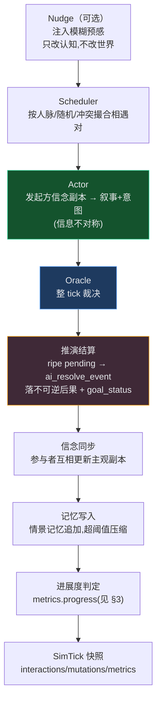
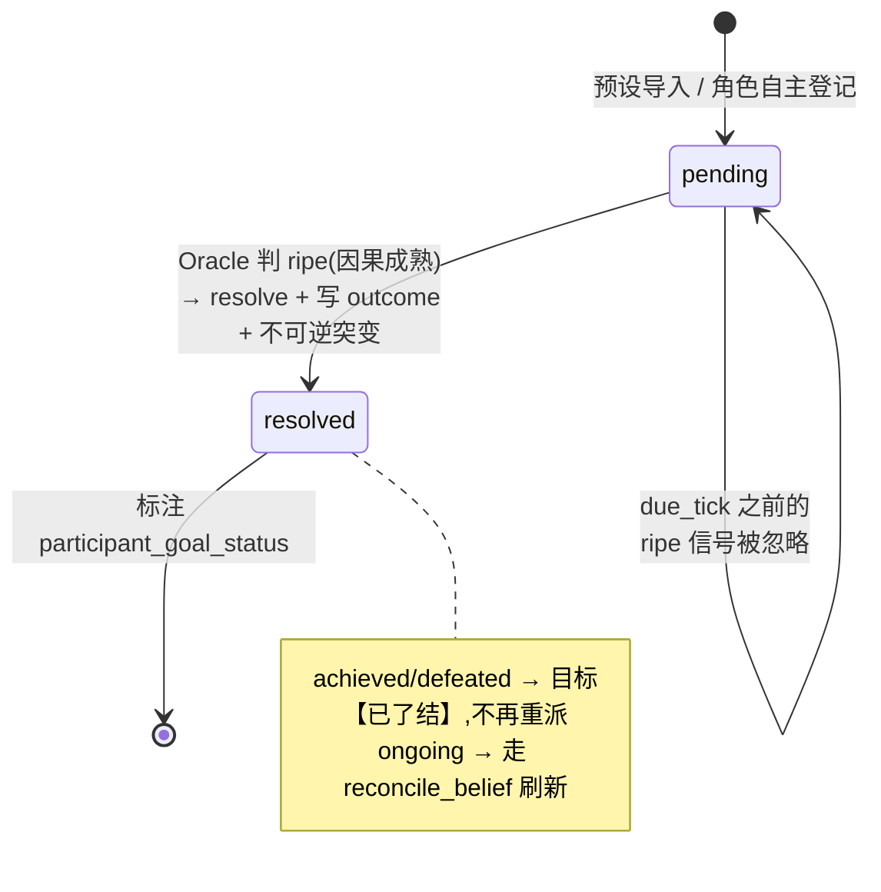

# 模拟器推演引擎

> 「导演不决定发生什么，世界状态决定。」

WorldBuilder 的模拟器不是剧情生成器，而是一台**因果推演引擎**：每个 tick 的结果都从内部世界状态（关系权重、角色目标、悬决事件、信念副本）因果推导出来，而不是由一个「导演」注入戏剧冲突。本文档说明引擎如何推进、如何结算，以及——同样重要——**它如何知道该停下来**。

相关代码：

- `backend/app/services/simulation.py` —— `run_tick` 主流程、推演结算、进展度判定、防枯竭节流
- `backend/app/services/sim_runner.py` —— 后台自动演化循环与落幕暂停
- `backend/app/services/ai_service.py` —— Actor / Oracle / `ai_resolve_event` LLM 调用
- `scripts/deduction_regression_test.py` —— 无需 LLM 的确定性回归用例

---

> 📐 想先建立全局心智模型（两台引擎、数据模型、信念层、ST 桥）？见 [`architecture.md`](architecture.md)。本文专注推演引擎的内部机制。

## 1. 一次 tick 的生命周期



| 阶段 | 职责 |
|------|------|
| **Nudge** | 可选地向选定角色注入模糊预感，打破僵局（不直接改世界状态，只改角色认知） |
| **Scheduler** | 按人脉权重 / 随机 / 冲突撮合挑选本 tick 的相遇对 |
| **Actor** | 每场相遇由**发起方的信念副本**生成叙事与意图（信息不对称：对手视角事后机械同步） |
| **Oracle** | 整 tick 裁决：关系权重突变、事件结晶、悬决登记、给出 `ripe_events` 信号 |
| **推演结算** | 因果成熟的 `pending` 事件调用 `ai_resolve_event` 落下不可逆后果 |
| **信念同步** | 参与者互相更新主观世界副本 |
| **记忆写入** | 情景记忆追加，超阈值时压缩 |
| **进展度判定** | 计算 `metrics["progress"]`（见 §3），供后台循环判断世界是否入稳态 |

---

## 2. 悬决事件（pending event）与目标可达成

悬决事件是引擎的因果骨架。一个事件节点在 `properties` 上携带推演元数据：

```python
{
  "status": "pending",            # pending | resolved
  "stakes": "继承格局彻底反转…",   # 利害关系
  "due_tick": 10,                  # 可选；此前 ripe 信号无效
  "sequence_order": 2,             # 仅约束导入时预设锚点的结算顺序
  "outcome": "...",               # 结算后写入
  "participant_names": [...],
}
```

### 生命周期



| 阶段 | 说明 |
|------|------|
| `pending` | 预设导入或角色自主登记 |
| Oracle `ripe` | LLM 判断因果成熟；`due_tick` 之前的 ripe 信号被忽略 |
| `resolve` | `status=resolved` + 写入 `outcome` + 产生不可逆突变 |

### 目标可达成（移除「目标永动机」）

早期版本的一个病根：结算后无条件给所有参与者 `reconcile_belief` 重派新目标，于是赢家会**继续打一场已经打赢的仗**，目标冲突扫描永远能找到新冲突 → 无限播种新悬决。

修复：`ai_resolve_event` 现在额外标注每个参与者的 **`participant_goal_status`**：

| status | 处理 |
|--------|------|
| `achieved` / `defeated` | 目标落为「已了结」态——`goal` 加前缀 `【已了结】`、写入 `goal_status` 属性，**不再**重派新目标 |
| `ongoing` | 保留原有 `reconcile_belief` 刷新路径 |

`_goal_is_settled()` 据此让冲突扫描跳过已了结目标，赢家就此收手。

---

## 3. 进展度停止信号（核心 loop-stopper）

### 问题：停止信号曾经判错对象

后台循环原先用「零变更 tick」（`mutation_count == 0`）判断世界是否停滞。但引擎里有一组**防枯竭装置**（悬决空窗补种、drought directive、intent 兜底、结算后刷新目标）保证**每 tick 都有变更**，于是 `stable_streak` 永远归零，停止条件永不触发——世界一直「忙」却不「进」，从 tick 13 空转到 121。

### 修复：判「有没有进展」，而非「有没有动」

`run_tick` 末尾计算 `metrics["progress"]`（`_tick_made_progress`，`simulation.py`）。当且仅当本 tick 至少发生一项**实质前进**才为 `True`：

```python
_PROGRESS_STATE_KEYS = ("role", "title", "status", "power", "occupation")
_PROGRESS_WEIGHT_EPS = 0.05
```

| 算进展 | 不算进展 |
|--------|----------|
| 新事件 / 结算 / 新登记悬决 / 新建关系或实体 | 近义重复事件（被去重折叠） |
| 关系权重净变化 `> 0.05` | 关系权重纯抖动 `≤ 0.05` |
| `role/title/status/power/occupation` 状态键变化 | 仅 `goal` 文本改写、仅 `mood` 微调 |
| | 仅信念同步 |

> **为什么排除 `goal` 和 `mood`？** 信念层几乎每 tick 都会**重新推导目标文本**、情绪也时刻波动。若把这些算作进展，`progress` 会永远为 `True`，即使某条副线只是在原地打转。目标的**了结**由 `resolve_event`（永远算进展）来捕捉，而非靠目标文本变化。这是空转循环的真正根因，比表面诊断更深一层。

### 落幕：连续无进展即暂停

`sim_runner.py` 的后台循环据此累计 `stable_streak`：

```python
made_progress = bool((simtick.metrics or {}).get("progress"))
if stability_window:
    r.stable_streak = 0 if made_progress else r.stable_streak + 1
    if r.stable_streak >= stability_window:
        await _pause(session, sim, reason="quiescent")
        break
```

连续 `stability_window`（默认 **4**）个无进展 tick → 以 `reason="quiescent"` 暂停。前端收到该 reason（或 `max_ticks`）时，在互动流顶部显示「🎬 本幕落幕」，提示世界已入稳态而非卡死。

---

## 3.5 记忆检索：从纯时间到三维加权

> 致敬 Stanford **Generative Agents** 的 `new_retrieve`。

每场相遇，Actor 会拿到自己的「近期经历」记忆块。早期实现是**纯按时间**取最近 K 条（`episodics[-recent_k:]`）——久远但高度相关的关键记忆（如与当前对手的旧恩怨）会被最新的闲聊挤掉，削弱推演的因果连续性。

现在 `get_memory_block`（`memory.py`）在收到 focal 时改走 GA 式三维加权打分，对未压缩 episodics 评分后取 top-K（长期 summary 块照旧全量纳入，不参与打分）：

| 维度 | 取值 | 实现 |
|------|------|------|
| **recency** | `decay ** rank`，最新最高（`decay=0.99`） | `_recency_scores` |
| **importance** | 直接读已存储的 `salience`（结算余波 0.9 / 普通场景 0.5） | `_importance_scores` |
| **relevance** | focal 词作为子串命中 `content` 的比例 + 参与者命中当前对手的加成 | `_relevance_scores` |

三维各自归一化到 `[0,1]` 后加权求和，默认权重镜像 GA 的 `gw`：**recency 0.5 · relevance 3 · importance 2**。

> **为什么不用 embedding？** relevance 用中文安全的**子串/参与者重叠**实现，零新依赖、零额外延迟（GA 自身也内置了这条非 embedding 关键词路径）。focal 在调用现场由 `_actor_focal` 组装：当前对手名 + 双方 `goal` 短语 + 本 sim 活跃 pending 事件的 `name`/`stakes`——即「这场戏在谈什么」。

检索**只重排 Actor 记得哪些事，绝不改写世界状态、不碰目标**。`memory_weighted_retrieval=False` 可一键回退纯时间窗口（旧行为）。纯函数 `_score_memories` 由回归测试直接覆盖（见 §7）。

---

## 4. 防枯竭装置的节流阀

防枯竭装置本身不能删——没有它们世界可能过早枯竭。但它们曾**无条件**制造冲突，把世界架在永不停歇的状态。现在每个出口都加了**真实前向张力**门槛：

| 装置 | 节流条件 |
|------|----------|
| `_scan_goal_conflicts` | charged 关系**权重 ≥ `_TENSION_FLOOR`（0.5）** 且双方目标**均未了结**才算候选冲突 |
| `_ensure_future_pending` | 移除「队列空 ⇒ 必播种」反射；仅当加权门槛下**仍有真实候选**才播种，否则允许 pending 队列保持空 |
| drought directive / intent 兜底 | 场景里**没有指向未来的实质张力**（`_scene_has_forward_tension`）时，不强迫 Oracle 产出事件/悬决 |

净效果：主线了结、关系都已 settle 后，引擎**允许世界静下来**，配合 §3 的进展度信号自然落幕。

---

## 5. 事件结晶收敛

早期一局曾结晶出 **249 个**事件节点（近义重复如「X 引开 Y」×3 未折叠），污染 Oracle 上下文且不真实。收紧措施：

- `event_min_significance` 默认 `0.5 → 0.6`；drought 放宽下限 `0.25 → 0.4`——微场景留作记忆而非永久事件节点。
- 强化语义去重：`_event_dedupe_corpus` 喂更长窗口、`ai_filter_event_duplicates` 收紧合并判定，折叠近义事件。

同等剧情下，事件实体数显著下降（庄园局 249 → ~30）。编年史只记真正改变格局的节点，不记每次走廊交锋。

---

## 6. 关键配置项

存于 `Simulation.config`，缺省取 `DEFAULT_CONFIG`（`simulation.py`）。

| 键 | 默认 | 说明 |
|----|------|------|
| `max_encounters_per_tick` | 4 | 每 tick 最多几场相遇 |
| `memory_recent_k` | 8 | Actor 记忆块取多少条 episodic（加权检索的 top-K） |
| `memory_weighted_retrieval` | true | 三维加权检索；false=回退纯时间窗口 |
| `memory_recency_w` / `_relevance_w` / `_importance_w` | 0.5 / 3 / 2 | 检索三维权重（镜像 GA `gw`） |
| `memory_recency_decay` | 0.99 | recency 维度的时间衰减 |
| `scheduler_mix_conflict` | false | 额外撮合一对敌对/陌生角色 |
| `generate_events` | true | Oracle 是否结晶事件节点 |
| `event_min_significance` | 0.6 | 场景结晶为事件节点的显著度阈值 |
| `pending_max_age` | 8 | 悬决超时强制结算（0=关闭） |
| `nudge_strategy` | off | off / random / targeted / weighted |
| `tick_interval_sec` | 6 | 自动演化间隔（秒） |
| `max_ticks` | 0 | 自动暂停上限（0=不限，`reason=max_ticks`） |
| `stability_window` | 4 | 连续无**进展** tick 后落幕暂停（0=关闭，`reason=quiescent`） |

> ⚠️ `stability_window` / `max_ticks` 等预设仅在**新建模拟**时由 `SIM_CONFIG`（如 `manor_mystery_data.py`）写入；既有模拟需在 UI 内改配置或直接 PATCH `Simulation.config`。

---

## 7. 回归测试

无需 LLM 的确定性用例（`scripts/deduction_regression_test.py`）覆盖纯逻辑层：

```bash
cd scripts && ../backend/venv/bin/python deduction_regression_test.py   # 期望输出 OK
```

| 用例 | 验证 |
|------|------|
| `test_progress_detection` | 近义重复 + mood 微调 → `progress=False`；权重净变化/新事件/状态变更 → `True`；恰好 0.05 抖动为负例 |
| `test_scan_goal_conflicts` / `_below_floor` | 权重达档算候选、低于 `_TENSION_FLOOR` 被过滤 |
| `test_settled_goal_not_reseeded` | `goal_status=achieved` 的角色不再被冲突扫描选中 |
| `test_relevant_old_beats_irrelevant_recent` | 提到对手的久远记忆排名高于无关的最新闲聊 |
| `test_participant_match_boost` | 参与者命中当前对手 → 相关度加成生效 |
| `test_high_salience_surfaces` | 高 salience 余波压过低 salience 闲谈 |
| `test_recency_only_fallback` | `relevance_w=importance_w=0` 还原为纯时间序（旧行为） |

> 端到端验证只在沙盒副本或新建 demo 项目上跑，**严禁碰真实项目**。
